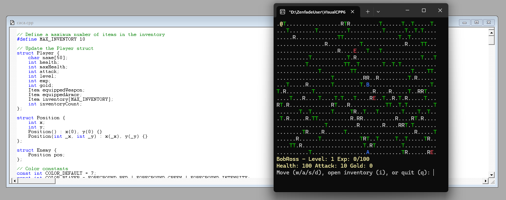

# CACA (Cave Camp)
A text-based RPG game written in C++ featuring exploration, combat, and inventory management.

## Description
Cave Camp is a simple console-based RPG where players can explore a randomly generated map, battle monsters, collect items, and level up their character. The game features colored ASCII graphics and turn-based gameplay.

## Features
- Randomly generated maps with trees, rocks, and teleport points
- Turn-based combat system
- Character progression with experience and leveling
- Inventory management system
- Equipment system (weapons and armor)
- Colorful ASCII graphics
- Enemy AI with basic movement patterns
- Item shop system

## Controls
- W/A/S/D - Move character (up/left/down/right)
- I - Open inventory
- Q - Quit game

## Game Elements
- @ - Player character
- T - Trees (obstacles)
- R - Rocks (obstacles)
- E - Enemies
- A/B - Teleport points
- . - Empty ground

## Building the Project
The project requires:
- Windows OS (uses Windows.h for colors)
- C++ compiler
- Visual Studio (recommended)

## Installation
1. Clone the repository
2. Open the project in Visual Studio
3. Build and run the solution

## License
This project is licensed under the MIT License - see the LICENSE file for details.

## Contributing
Feel free to fork the project and submit pull requests with improvements or bug fixes.

## Author
- openseb

## Acknowledgments
- Created in 1998 as a learning project
- Inspired by classic ASCII roguelike games
